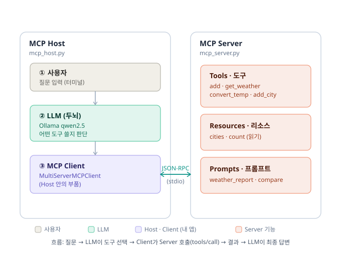

# mcp_example — FastMCP 순수 학습 예제

Claude(`cli_project`)와 **분리된** 폴더. LLM · API 키 · 인터넷 **전혀 필요 없음.**
MCP 서버의 3대 프리미티브(Tools · Resources · Prompts)를 Inspector로 직접 눌러보며 배운다.

> 원리: LLM이 도구를 호출하는 대신, **내가 웹 UI에서 버튼을 눌러** 도구를 실행한다. (내가 '뇌' 역할)

## 구조 한눈에



| MCP 개념 | 파일 / 위치 | 역할 |
|---|---|---|
| **MCP Host** | `mcp_host.py` | 사용자 · LLM · 클라이언트를 묶어 굴리는 앱 본체 |
| **MCP Client** | `mcp_host.py` 안의 `MultiServerMCPClient` | Host가 만들어 Server와 1:1 통신하는 커넥터 (별도 파일 아님) |
| **MCP Server** | `mcp_server.py` | 도구(Tools) · 리소스(Resources) · 프롬프트(Prompts) 제공 |

> 흐름: 질문 → LLM이 도구 선택 → Client가 Server 호출(`tools/call`) → 결과 → LLM이 최종 답변

## 준비물
- Python 3.10+
- uv (아래 0번에서 설치)
- Node.js (Inspector 실행용)
- (API 키 불필요)

## 0. 처음이라면 — 설치부터 (한 번만)

### uv 설치 (Windows PowerShell)
```powershell
powershell -ExecutionPolicy ByPass -c "irm https://astral.sh/uv/install.ps1 | iex"
```
설치 후 **터미널을 닫았다 새로 열고** 확인:
```powershell
uv --version
```

### Node.js 확인 (Inspector용)
```powershell
node --version
```
버전이 안 나오면 https://nodejs.org 에서 LTS 설치 후 터미널 다시 열기.

> uv 설치가 막히면(회사 정책 등) 아래 "방법 B — 일반 venv"로 진행.

## 실행 방법

### 방법 A — uv (권장, 가장 간단)
```bash
cd MCP/mcp_example
uv run --with "mcp[cli]" mcp dev mcp_server.py
```
> `--with "mcp[cli]"` 가 필요한 패키지를 자동 설치하고 실행한다 (별도 install 불필요).
> 처음 실행 시 "Installed N packages" 가 뜨면 정상.

### 방법 B — 일반 venv
```bash
python -m venv .venv
.venv\Scripts\activate        # Windows (Git Bash: source .venv/Scripts/activate)
pip install -r requirements.txt
mcp dev mcp_server.py
```

→ 터미널에 `http://127.0.0.1:6274` 주소가 뜨면 브라우저로 열기.

## Inspector에서 확인할 것

브라우저에서 **Connect** 누른 뒤, 상단 세 탭을 각각 확인:

| 탭 | 확인 | 해보기 |
|---|---|---|
| **Tools** | `add`, `get_weather` 보임 | `add` → a=2, b=3 → Run → **5** / `get_weather` → city=서울 → **맑음, 24도** |
| **Resources** | `weather://cities` (목록) | 클릭 → 도시 목록 JSON 확인 |
| **Resource Templates** | `weather://cities/{city}` | city=부산 입력 → **흐림, 22도** |
| **Prompts** | `weather_report` | city=제주 입력 → 생성된 프롬프트 문장 확인 |

### 에러도 일부러 내보기
- `get_weather` 에 없는 도시(예: `런던`) → 에러 메시지 뜨는지 (검증 동작 확인)

## 다음 단계
- 서버 동작을 눈으로 확인했으면 → 여기에 도구/리소스를 더 추가해보기
- LLM과 연결하고 싶으면 → (키 없이) Ollama 로컬 모델, 또는 Gemini 무료 키로 별도 클라이언트 붙이기
- 핵심 개념 복습 → 상위 폴더의 [강의노트.md](../강의노트.md)
