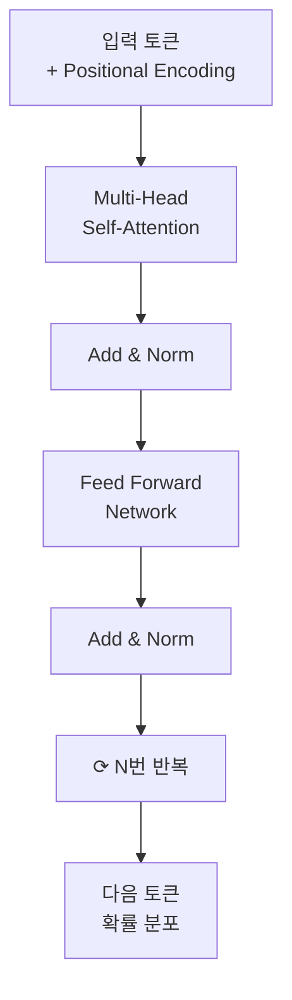
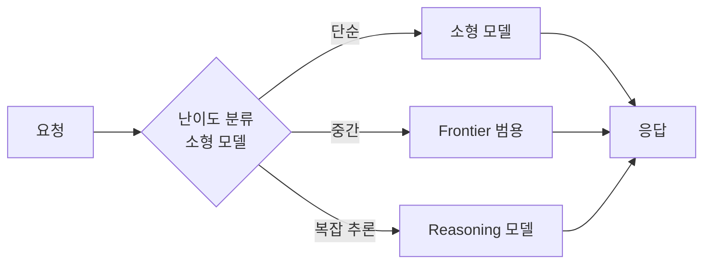

# Part 1. LLM 기초

> **한 줄 요약**: 2026년의 LLM이 어떻게 동작하는지를 *2017년 Transformer 페이퍼부터 현재 학습 파이프라인·토큰 경제학까지* 한 흐름으로 갱신한다.

## 들어가며

당신이 ML 경험자라면 신경망과 기울기 강하 같은 기본기는 이미 머릿속에 있을 것이다. 그러나 LLM은 *언어를 다루는 한 가지 응용* 이 아니라, 2017년 이후 별도의 진화 계통을 만들어왔다. 어텐션의 등장, 토큰화의 미묘함, 3단계 학습 파이프라인, RLHF/DPO의 분기, 그리고 2026년 시점 *토큰 경제학* 까지 — 이것들은 ML 일반 교과서엔 없다.

Part 1의 목표는 두 가지다:

1. **LLM의 작동 원리를 *왜* 그렇게 설계됐는지** 까지 이해해서, 새 모델이 나와도 빠르게 판독 가능하게 한다.
2. **2026년 5월 시점의 LLM 지형과 가격 구조** 를 안다. 이것은 Part 2 이후 모든 의사결정(어느 모델을 쓸지, 얼마나 길게 컨텍스트를 줄지, 캐싱을 쓸지)의 기반이 된다.

---

## 1.1 Transformer 아키텍처

### 핵심
LLM의 99%는 *Decoder-only Transformer* 다. 핵심 구성은 (a) 토큰을 벡터로 만든다 → (b) 같은 블록을 N번 반복하며 각 토큰이 다른 토큰을 "쳐다본다(attention)" → (c) 마지막에 다음 토큰의 확률 분포를 출력한다.

### Self-Attention: Query, Key, Value

각 토큰은 세 개의 벡터로 변환된다:

- **Query (Q)**: "내가 무엇을 찾고 있나?"
- **Key (K)**: "나는 이런 정보를 갖고 있다"
- **Value (V)**: "내가 갖고 있는 정보의 실제 내용"

수식: `Attention(Q, K, V) = softmax(QK^T / √d_k) · V`

직관: 토큰 i가 토큰 j를 *얼마나 참조할지* 를 `Q_i · K_j` 로 계산하고 (softmax로 정규화), 그 가중치만큼 `V_j` 를 가져온다. 모든 토큰이 모든 토큰을 *동시에* 참조한다는 게 RNN과의 결정적 차이.

### Multi-Head Attention

위 동작을 한 번만 하지 않고 *여러 head로 병렬* 로 수행한다. head마다 다른 Q/K/V 투영 행렬을 학습해서, 한 head는 문법 구조에, 다른 head는 의미 관계에, 또 다른 head는 위치 패턴에 집중한다. Frontier 모델은 한 층에 64~128개 head가 있는 식.

### Positional Encoding — 왜 중요한가

Attention 자체는 순서를 모른다 ("나는 사과를 먹었다" = "먹었다 사과를 나는"). 그래서 *위치 정보* 를 따로 주입해야 한다.

- **Absolute Sinusoidal** (2017 원조): sin/cos 함수로 각 위치에 고유 패턴
- **Learned Absolute**: 위치를 임베딩처럼 학습 (GPT-2 시절)
- **RoPE (Rotary Position Embedding)**: 회전 행렬로 *상대 위치* 인코딩. **현재 사실상 표준** (Llama, Qwen, Mistral 등)
- **ALiBi**: attention score에 거리 패널티. 추가 학습 없이 *컨텍스트 확장* 에 강함

> **2026 트렌드**: RoPE + YaRN/NTK 보간으로 *학습 시 4K, 추론 시 128K~1M 컨텍스트* 가 표준이 됨.

### Transformer Block 한 장 다이어그램



### FFN, Residual, LayerNorm

- **FFN (Feed-Forward Network)**: attention 뒤에 위치한 *2층 MLP*. 보통 `hidden_dim → 4×hidden_dim → hidden_dim`. 모델 파라미터의 약 2/3이 여기에 있다.
- **Residual Connection**: `x = x + Attention(x)`, `x = x + FFN(x)`. 깊은 모델 학습 안정성의 핵심.
- **LayerNorm vs RMSNorm**: 2026년 표준은 *Pre-RMSNorm* (계산이 더 가볍고 효과는 동등).

### Encoder vs Decoder vs Encoder-Decoder

| 구조 | 대표 | 용도 |
|---|---|---|
| Encoder-only | BERT 계열 | 분류 · 검색 임베딩 |
| **Decoder-only** | **GPT · Claude · Llama** | **생성 (사실상 모든 챗 LLM)** |
| Encoder-Decoder | T5, Whisper | 번역, 음성→텍스트 |

2026년 챗 LLM은 거의 모두 *Decoder-only* 다. 이유: 동일 파라미터로 더 큰 컨텍스트, 더 자연스러운 생성, 더 단순한 학습 목적함수(다음 토큰 예측).

### 💡 Key Insight

> **LLM은 *다음 토큰 확률 분포를 출력하는 함수* 다.** 그게 전부. 추론, 창의성, 도구 사용 같은 능력은 이 단순한 함수가 *충분히 큰 규모와 데이터* 에서 학습되었을 때 *창발(emerge)* 되는 현상이다.

### 🛠️ 손으로 해보기

Karpathy의 *Let's build GPT from scratch* 영상을 따라가며 nanoGPT를 셰익스피어 데이터로 1회 학습. 약 4시간. self-attention의 `Q @ K.T` 한 줄이 영원히 머릿속에 남는다.

### ✅ 자가 점검

1. Self-Attention에서 `√d_k` 로 나누는 이유는?
2. RoPE가 Absolute보다 *컨텍스트 확장* 에 유리한 이유는?
3. Encoder-Decoder를 안 쓰고 Decoder-only로 가는 이유 2가지?

---

## 1.2 토큰화와 임베딩

### 핵심
LLM은 *글자* 가 아니라 *토큰* 단위로 본다. 토큰화 방식과 어휘 사전(vocabulary)은 모델마다 달라서, **같은 문장이라도 모델마다 토큰 수가 다르다 → 비용과 컨텍스트가 다르다**.

### BPE · WordPiece · SentencePiece

- **BPE (Byte-Pair Encoding)**: 가장 빈번한 *문자 쌍* 을 반복적으로 병합. GPT 계열 · Llama 표준.
- **WordPiece**: BPE 변형. 빈도가 아니라 *우도(likelihood)* 기반 병합. BERT 계열.
- **SentencePiece**: 공백을 *문자처럼* 취급. 다국어 · CJK에 강함. Llama, Gemma 등 대부분 이쪽으로 갔다.

### 토큰화 흐름

```
"Hello, world!"
   ↓ (BPE 적용)
["Hello", ",", " world", "!"]
   ↓ (vocab lookup)
[15496, 11, 995, 0]
   ↓ (embedding matrix, V × d)
[[0.12, -0.43, ...], [...], [...], [...]]    ← (seq_len, hidden_dim)
```

### 한국어 · CJK 토큰화의 함정

영어는 *1 토큰 ≈ 0.75 단어* 인데, **한국어는 1 단어 ≈ 2~3 토큰** 인 경우가 흔하다. 이유: 어절 단위 한국어가 BPE 사전에 거의 없어서 자모 단위로 쪼개진다.

| 문장 | 영어 모델 토크나이저 | 다국어 강화 토크나이저 |
|---|---|---|
| "Hello, how are you?" | 6 토큰 | 6 토큰 |
| "안녕하세요, 어떻게 지내세요?" | 18~22 토큰 | 12~15 토큰 |

→ **한국어 작업이 많다면 토크나이저가 더 효율적인 모델을 고르는 것만으로 30~40% 비용 절감 가능.**

### 임베딩이 학습하는 것

토큰 ID는 그냥 숫자다. 임베딩 행렬 `E ∈ R^(V × d)` 가 ID를 *d차원 벡터* 로 변환한다. 학습이 끝나면 의미적으로 가까운 토큰(`king`, `queen`)이 벡터 공간에서도 가깝다. 유명한 `king - man + woman ≈ queen` 도 여기서 비롯.

### 💡 Key Insight

> **토큰은 비용 단위이자 컨텍스트 단위다.** "한국어 100자 ≈ 영어 75자" 가 아니라 *"한국어 100자 ≈ 영어 75자의 토큰 수 1.5~2배"* 다. 같은 작업을 영어 프롬프트로 작성하면 30%+ 절약될 때가 있다는 뜻.

### 🛠️ 손으로 해보기

```python
import tiktoken
enc = tiktoken.encoding_for_model("gpt-4o")

text_ko = "안녕하세요, 오늘 점심 메뉴는 무엇인가요?"
text_en = "Hello, what's for lunch today?"

print(f"KO: {len(enc.encode(text_ko))} tokens")
print(f"EN: {len(enc.encode(text_en))} tokens")
```

본인이 자주 쓰는 프롬프트 5개로 측정. 같은 의미인데 토큰 수 비교.

### ✅ 자가 점검

1. BPE와 SentencePiece의 핵심 차이는?
2. 같은 한국어 문장도 모델마다 토큰 수가 다른 이유는?
3. 임베딩 행렬의 차원이 `(V × d)` 인 이유는?

---

## 1.3 학습 파이프라인 — Pretrain → SFT → RLHF/DPO

### 핵심
2026년 챗 LLM은 *3단계* 로 만들어진다. (1) 사전학습으로 *언어 일반 능력* 을, (2) 지도학습으로 *지시 따르기* 를, (3) 강화학습 또는 DPO로 *인간 선호 정렬* 을 학습시킨다.

### Stage 1: Pretraining

- **목적함수**: 다음 토큰 예측 (causal language modeling)
- **데이터**: 수조 토큰 단위 (Llama 3는 15T, Frontier 모델들은 추정 13T~30T+)
- **하드웨어**: 수만 개 GPU/TPU × 수개월
- **비용**: $10M ~ $100M+

핵심 통찰은 *Chinchilla 스케일링 법칙* (2022): 모델 크기와 데이터를 *대략 1:20 비율로 함께 키워야* 최적. 이전의 "큰 모델 + 적은 데이터" 트렌드를 뒤집었다.

### Stage 2: Supervised Fine-tuning (SFT)

사전학습 모델은 "이어쓰기" 만 할 줄 안다. "프랑스의 수도는?" 이라고 물으면 "한국의 수도는? 일본의 수도는? ..." 식으로 *문제집을 이어쓸 수도 있다*.

SFT는 *(instruction, response)* 쌍 수만~수십만 개로 fine-tune해서 "질문엔 대답한다" 는 패턴을 학습시킨다. 대표 데이터셋 계열: FLAN, Alpaca, OpenHermes.

### Stage 3a: RLHF (Reinforcement Learning from Human Feedback)

SFT만으론 *도움이 되는 답 vs 그저 그런 답* 의 차이를 모른다. RLHF는:

1. **Reward Model 학습**: 사람이 응답 쌍 A vs B 중 더 좋은 걸 고른다 → 이 선호도로 보상 모델 학습.
2. **PPO 강화학습**: SFT 모델을 보상 모델 점수를 최대화하도록 fine-tune. 동시에 *원본에서 너무 벗어나지 않도록* KL 페널티.

ChatGPT의 "도움됨" 의 핵심이 이 단계.

### Stage 3b: DPO와 그 변형 — 2024년 이후 대세

RLHF는 복잡하고 불안정하다 (보상 모델 + PPO 두 모델 동시 운영).
**DPO (Direct Preference Optimization, 2023)**: 보상 모델 없이 *선호 데이터로 직접* LLM을 fine-tune. 수학적으로는 RLHF와 같은 목적함수, 한 단계 빠른 구현.

| 방법 | 보상 모델 필요? | 안정성 | 2026 채택률 |
|---|---|---|---|
| RLHF (PPO) | ✅ | 낮음 | 줄어듦 |
| DPO | ❌ | 높음 | 표준 |
| IPO · KTO · ORPO | ❌ | 높음 | DPO 보완 |

### Constitutional AI (RLAIF)

사람 라벨러 대신 *AI가 헌법(원칙 목록)을 보고 스스로 응답을 비평·수정* 한다. RLHF의 *Human* 을 *AI* 로 치환 → RLAIF (Reinforcement Learning from AI Feedback).

### 💡 Key Insight

> **LLM의 *재능* 은 Pretraining에서 오고, *예의범절* 은 SFT/DPO에서 온다.** Fine-tuning이 *새 지식을 거의 안 가르친다* 는 건 자주 잊힌다. "내 회사 문서로 fine-tune 하면 똑똑해질까?" 의 답은 보통 *"아니, RAG 써라"* 다.

### 🛠️ 손으로 해보기

작은 오픈소스 모델(Qwen 1.5B 등)을 Hugging Face TRL 라이브러리로 *DPO* 한 번 돌려본다. 데이터는 UltraFeedback. 1~2시간, 콜랩 T4 무료 한도 안에서 가능.

### ✅ 자가 점검

1. Pretraining만으로는 챗봇이 안 되는 이유는?
2. DPO가 RLHF보다 단순한 핵심 이유는?
3. "fine-tuning으로 새 지식 주입" 이 잘 안 되는 이유는?

---

## 1.4 디코딩 전략

### 핵심
LLM은 매 스텝 *어휘 전체에 대한 확률 분포* 를 출력한다. 거기서 *어떻게 한 토큰을 뽑을지* 가 디코딩 전략이다. 같은 모델 · 같은 프롬프트라도 디코딩이 다르면 답이 다르다.

### Greedy / Sampling / Beam

- **Greedy**: 매번 확률 최대 토큰 선택. 결정적이지만 단조롭고 반복이 잘 생긴다.
- **Sampling**: 확률에 비례해 무작위 선택. 자연스러움 ↑, 일관성 ↓.
- **Beam Search**: 상위 k개 후보를 동시 추적. 번역엔 좋지만 챗엔 거의 안 씀 (단조로움).

### Temperature

샘플링 분포의 *날카로움* 을 조절한다. 확률 분포에 `softmax(logits / T)` 를 적용:

- `T → 0`: 거의 greedy. 결정적, 보수적.
- `T = 1.0`: 모델 원본 분포.
- `T → ∞`: 균일 분포. 거의 무작위.

| Temperature | 용도 |
|---|---|
| 0.0 ~ 0.3 | 코드, 추출, 사실 답변, 데이터 변환 |
| 0.5 ~ 0.8 | 일반 대화, 요약, 분석 |
| 1.0 ~ 1.5 | 창의 글쓰기, 브레인스토밍 |

### Top-k와 Top-p (Nucleus Sampling)

확률 분포의 *꼬리* 를 잘라낸다 → 말이 안 되는 토큰이 뽑힐 확률을 0으로.

- **Top-k**: 상위 k개만 남기고 나머지 0. (예: k=50)
- **Top-p (Nucleus)**: 누적 확률 p가 될 때까지의 토큰만. (예: p=0.95) — 더 적응적, 현재 표준.

### Speculative Decoding — 2024년 이후 추론 가속의 핵심

작은 *draft 모델* 이 여러 토큰을 미리 추측 → 큰 *target 모델* 이 *병렬* 로 검증. 맞으면 한 번에 여러 토큰 확정, 틀리면 거기까지만 채택.

> **결과**: 동일 품질에 추론 속도 2~3배. 2026년 거의 모든 상용 추론 엔진이 채택.

### 💡 Key Insight

> **Temperature 0이 항상 "정답" 은 아니다.** 코드 생성도 T=0이 *틀린 코드를 자신 있게 반복* 하게 만들 때가 많다. T=0.2~0.3 + 자기검증 루프가 종종 더 정확하다.

### 🛠️ 손으로 해보기

같은 프롬프트("3문장으로 양자컴퓨터를 설명하라")를 T = 0.0, 0.3, 0.7, 1.2 네 번 돌려서 결과 비교. *어디부터 헛소리가 시작되는가* 가 본인의 작업별 적정 T를 알려준다.

### ✅ 자가 점검

1. Temperature 1.0과 0.5의 차이를 *분포 모양* 으로 설명하면?
2. Top-p가 Top-k보다 선호되는 이유는?
3. Speculative Decoding이 *품질을 떨어뜨리지 않는* 이유는?

---

## 1.5 2026 LLM 지형도

### 핵심
2026년 LLM은 4개 카테고리로 정리된다. 한 가지 모델로 모든 걸 하는 시대는 끝났고, *작업별 최적 모델을 라우팅* 하는 게 표준.

### 4가지 카테고리

| # | 카테고리 | 특징 | 대표 용도 |
|---|---|---|---|
| 1 | **Frontier 범용** | 최상위 능력, 비싸고 느림 | 복잡한 추론·코딩·고가치 출력 |
| 2 | **Reasoning 특화** | 내부적으로 더 오래 사고, 토큰 소모↑ | 수학·복잡 코딩·다단계 추론 |
| 3 | **소형/온디바이스** | 빠르고 싸다 (1~10B 파라미터) | 분류·라우팅·대량 처리·온디바이스 |
| 4 | **오픈소스 자가호스팅** | 직접 운영, 데이터 주권 | 규제 산업·온프레미스 |

### 모델 선택 4축

| 축 | 질문 |
|---|---|
| **능력** | 이 모델이 이 작업을 *실제로 풀 수 있는가* |
| **비용** | input/output 1M 토큰당 가격 |
| **지연** | 첫 토큰 시간(TTFT), 총 응답 시간 |
| **라이선스** | 상업 사용 가능? 데이터 외부 송신 가능? |

### 라우팅 패턴 — 한 모델로 끝내지 않는다



→ 단순 요청을 Frontier로 보내면 *10배 비싸고 5배 느린* 라면 끓이기.

### ⚠️ 주의: 이 절은 분기 단위로 갱신된다

본 챕터의 모델명 · 가격 · 점수는 *2026년 5월* 기준이다. **실시간 정보는 LMArena, Artificial Analysis, Vellum Leaderboard 같은 공개 벤치를 직접 확인하라.** 본 책은 *판단 프레임워크* 를 가르치는 게 목적이지 *현재 1등이 누군지* 를 박제하는 게 아니다.

### 💡 Key Insight

> **"가장 좋은 LLM이 뭐냐" 는 잘못된 질문이다.** 옳은 질문은 *"이 작업에 대해 능력 · 비용 · 지연의 균형이 가장 좋은 LLM이 뭐냐"* 다. 모델 라우팅은 2026년 모든 진지한 AI 시스템의 기본기.

### 🛠️ 손으로 해보기

본인이 자주 하는 작업 5개를 적어두고, 각각에 대해 *(Frontier · Reasoning · 소형) 3종* 을 같은 프롬프트로 돌린다. *비용 · 시간 · 품질* 3축으로 표 채우기. 본인용 결정 매트릭스 완성.

### ✅ 자가 점검

1. Reasoning 모델이 일반 모델보다 *느리고 비싼* 이유는?
2. 오픈소스 모델을 *자체 호스팅* 할 때 추가로 고려할 비용은?
3. 같은 작업을 *소형 → Frontier* 로 escalate 하는 라우팅 패턴의 장점은?

---

## 1.6 토큰 경제학

### 핵심
API 가격은 *토큰 단위* 다. *입력 토큰 ≠ 출력 토큰* 가격이고, *컨텍스트 윈도우 ≠ 무료* 이며, *캐싱* 으로 큰 폭 절감이 가능하다. 이 세 가지를 모르면 비용이 10배 차이 난다.

### 가격 구조의 비대칭성

대부분의 LLM 가격표는 이런 식 (2026년 5월 기준 일반 추정):

| 등급 | Input ($/1M) | Output ($/1M) | 비율 |
|---|---|---|---|
| Frontier | $3 ~ $15 | $15 ~ $75 | ≈ 1:5 |
| 중급 | $0.5 ~ $3 | $2 ~ $15 | ≈ 1:5 |
| 소형 | $0.05 ~ $0.5 | $0.2 ~ $2 | ≈ 1:4 |

**Output이 Input보다 4~5배 비싸다.** 이유: 출력은 *순차적으로* 한 토큰씩 생성되어 GPU를 더 점유.

→ **함의**: 긴 출력을 짧게 다듬는 것이 긴 입력을 짧게 다듬는 것보다 *훨씬* 절약된다.

### 컨텍스트 윈도우 비용 곡선

컨텍스트 길이가 늘면 비용은 *선형* 으로 늘지만, attention 계산은 *제곱* 으로 늘어서 *지연* 이 급증한다.

```
컨텍스트 4K → 32K 로 늘리면:
  비용: 8배
  지연: 약 20~30배 (이론상 64배, FlashAttention 등으로 완화)
```

→ "다 때려넣고 알아서 골라줘" 는 비용 · 지연 양쪽으로 비싸다. *컨텍스트 관리* 가 필요한 이유.

### Prompt Caching — 2024년 후반 등장한 폭탄

같은 *접두사(prefix)* 를 재사용하는 요청들은 KV 캐시를 재활용해서 **입력 비용 50~90% 할인**. 보통:

- **캐시 쓰기**: 통상 가격의 ≈ 1.25배 (한 번)
- **캐시 읽기**: 통상 가격의 ≈ 0.1배 (이후 모든 요청)
- **TTL**: 5분 ~ 1시간

**사용 패턴**:

- 시스템 프롬프트가 길고 정적 → 캐시
- RAG 컨텍스트가 동일 세션에서 반복 → 캐시
- 대화 히스토리 누적 → 캐시

### Batch API — 비실시간 작업이면 50% 할인

24시간 이내 처리 OK라면 *Batch API* 로 절반 가격. 분류 · 요약 대량 처리 등 비실시간 워크로드에 적합.

### 💡 Key Insight

> **토큰 비용의 90%는 *설계* 에서 결정된다.** 모델 선택, 캐싱 활용, 출력 길이 제한, 작업 분할 — 코드 한 줄 바꾸기 전에 이 4가지가 비용을 10배 좌우한다.

### 🛠️ 손으로 해보기

본인의 가장 자주 쓰는 워크플로 1개에 대해 다음을 측정:

1. 1회 호출당 input/output 토큰 수
2. 월 호출 횟수 추정 → 월 비용
3. 시스템 프롬프트에 캐싱 적용 시 절감액

`tiktoken` 또는 Anthropic 토큰 카운터로 측정.

### ✅ 자가 점검

1. Output이 Input보다 비싼 *기술적* 이유는?
2. 컨텍스트가 길어질 때 *비용보다 지연이 더 빨리* 늘어나는 이유는?
3. Prompt Caching이 *효과 있는 워크로드* 와 *효과 없는 워크로드* 의 차이는?

---

## 이 Part를 마치며

여기까지 왔다면 당신은 다음을 안다:

- LLM이 *왜* 그렇게 동작하는지 (단순한 다음 토큰 예측 함수)
- 토큰화 · 디코딩 · 학습 단계가 *왜 그 순서로* 있는지
- 2026년 모델을 *어떤 축으로* 비교해야 하는지
- 토큰 비용이 *어디서* 결정되는지

이건 Part 2(프롬프트 · 컨텍스트)부터 모든 의사결정의 기반이다.

다음 Part에선 이 LLM이라는 *함수* 에게 *어떻게 입력을 잘 줄지* — 프롬프트와 컨텍스트의 기예로 넘어간다.

---

### 📚 Part 1 핵심 한 페이지 요약

| 절 | 한 문장 결론 |
|---|---|
| 1.1 | LLM은 *Decoder-only Transformer*, 핵심은 Self-Attention + RoPE. |
| 1.2 | 같은 문장도 토크나이저에 따라 토큰 수가 1.5~2배 차이. 한국어는 특히 손해. |
| 1.3 | Pretrain → SFT → DPO. 재능은 사전학습, 예의범절은 정렬 단계. |
| 1.4 | Temperature 0이 항상 정답은 아니다. 작업별로 다르다. |
| 1.5 | 4가지 카테고리 × 4축 (능력·비용·지연·라이선스)로 라우팅 설계. |
| 1.6 | 비용의 90%는 *설계* 에서 결정. Output·컨텍스트·캐싱 3가지가 핵심. |
